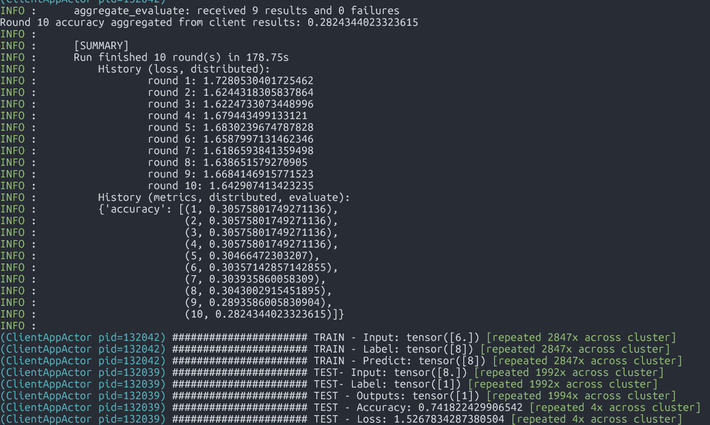

# Applied Federated Learning in Process Mining in IoT network 

### Starting

#### Step 1: Reproduced the working solutions

Read this paper “A Comparison of Deep-Learning Methods for Analysing and Predicting Business Processes” 
[Link](https://arxiv.org/pdf/2102.07838), access Github Reposistory [Link](https://github.com/ishwarvenugopal/GCN-ProcessPrediction/tree/master).
Clone project and reproduce the result in local machine.
Understand the ideas & target behind solutions.

#### Step2: Transform the context from central to IoT

Provided data above is simulated for the central event database. However, in distributed manner, each edge device only keeps its own local database including its own activity and complete_timestamp. 
After discovery phase, learned from this paper “EdgeMiner: Distributed Process Mining at the Data Sources” [Link](https://arxiv.org/pdf/2405.03426), the edge local database would include also its own Most-Frequent-Predecessors (MFP).
Therefore, instead of 1 CSV files represented for central DB, there would be 9 CSV files for 9 activity nodes.

#### Step 3: Federated Learning jorney start! - with Flower AI framework [Link](https://flower.ai/docs/framework/index.html)

### Flower Architecture (simulation mode)

It is configured to have 9 Flower clients with respect to 9 activity nodes in the original dataset.
Each local data file (mentioned above) would be assigned to each client.
The clients would train data with a general MLP model with Linear layers and Sigmoid activations.
Then the validation would be calculated with CrossEntropyLoss function.
After an epoch, all training results would be transfered to server and aggregated.

### Explaination

* __Target__: each client would be trained the MLP model with its own local dataset to predict its Most-Frequent-Predecessors (MFP).

* __Activation__: There are 9 activity nodes which means there are 10 labels. The Sigmoid activation function is chosen for the output probabilities in binary classification models (multi-class problem).

* __Loss__: CrossEntropyLoss is used in binary classification models to predict models.

* __Dropout__: it is added because the local database is small, therefore Dropout is added to avoid overfitting.

* __Partition__: `NaturalIdPartitioner(partition_by="ActivityID")`, followed this document [Link](https://flower.ai/docs/datasets/ref-api/flwr_datasets.partitioner.NaturalIdPartitioner.html#flwr_datasets.partitioner.NaturalIdPartitioner).

* __Server Aggregation__: for accuracy calculation, we need to create a custom strategy for server to aggregate results from clients.

  * Call `aggregate_evaluate` from base class (__FedAvg__) to aggregate loss.

  * Weighted accuracy of each client by number of examples used

### Result & Discussion

* The entire process completed successfully without errors. After 10 epochs, the current loss stabilized at 1.642, and the accuracy averaged around 30%.

* This is just an initial baseline, with no feature engineering applied. The input layer is quite basic, consisting only of the current activity node. The target label is predicted using the MFPs, which are assumed to be detected during the discovery phase (as explained above). Consequently, these results are not optimal.

### Next Steps

* You can find the setup in Github: [Link](https://github.com/trinh-tnp/federated-learning)

* __Feature Engineering__: We can add more features in the input layer for example: time delta between 2 activities, the date of week of the occurrences, etc.

* __Deployment__: The current setup is running in 1 machine with multiple processes running with Ray backend. However, to make the experiment is as close as possible to the production, we should deploy on different devices to evaluate its performance.

* Other dataset: We can continue evaluating this setup with more different dataset with multiple data sizes.
